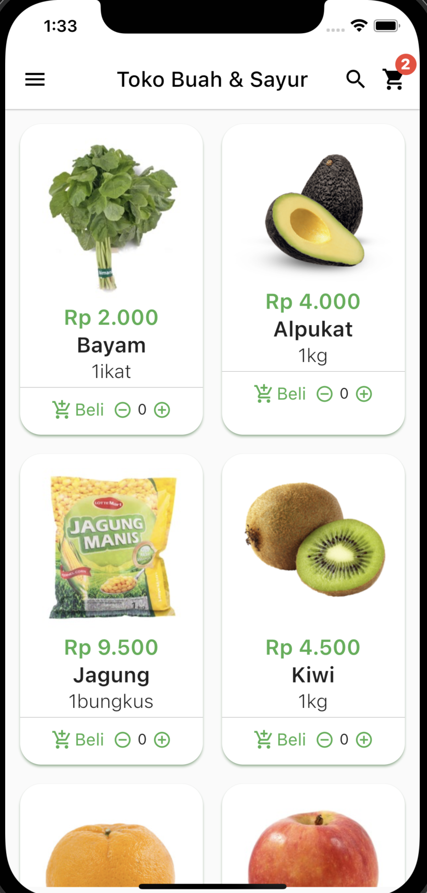
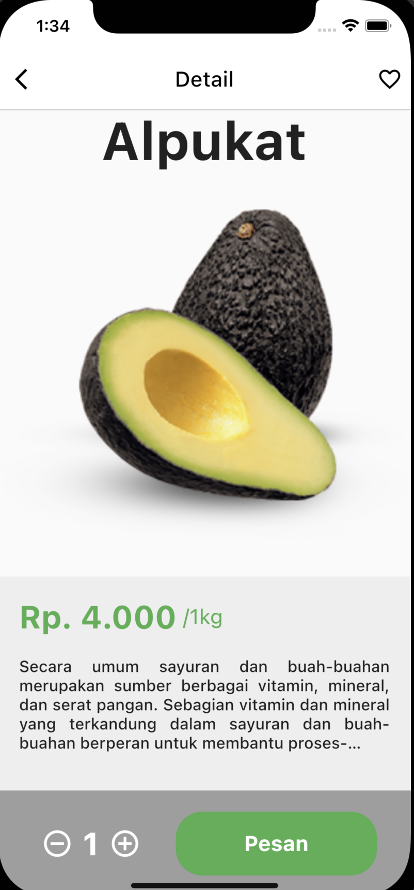

# flutter_grocery_ui

Layouting the UI for Grocery App Toko Sayur dan Buah

## Widget

- GridView.Builder
- Card
- Hero
- IconButton
- Gesuture Detector
- Navigator push
- Navigator pop
- Data Class
- Column
- Row
- Image Asset
- App Bar
- Stateful widget
- Stateless widget
- setState
- AspectRatio
- SizedBox
- Container
- Text
- TextStyle
- Scaffold

## ScreenShot

| Home        | Submit    |
|--------------|-----------|
|  |       |

